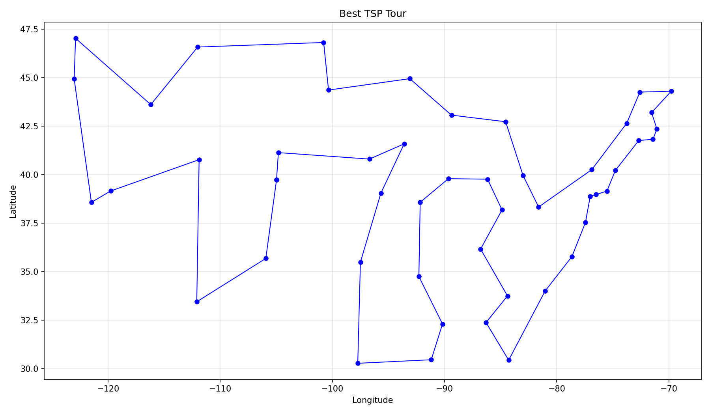
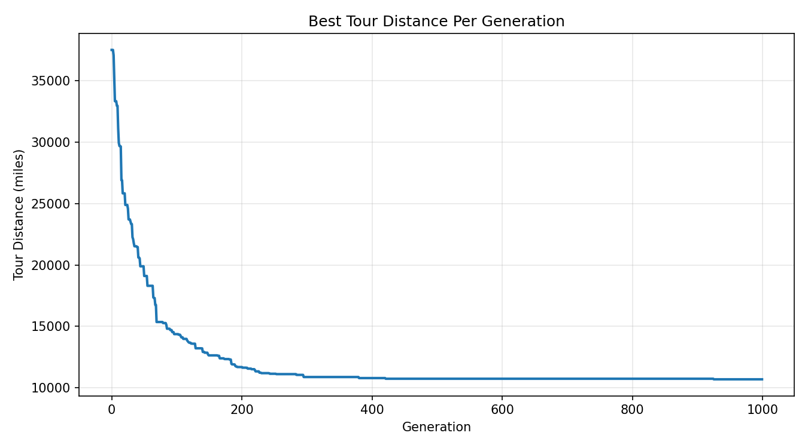

<!-- SHOWCASE: false -->

# Traveling Salesman Problem - Genetic Algorithm Solver

> Solves the Traveling Salesman Problem using a genetic algorithm with ordered crossover and inversion mutation, optimizing a tour of all 49 lower US state capitals by Haversine distance.


---

## Course Information

| Field                  | Details                                                                                                                                                                                                                                                                                   |
| ---------------------- | ----------------------------------------------------------------------------------------------------------------------------------------------------------------------------------------------------------------------------------------------------------------------------------------- |
| Course Title           | Evolutionary Computation                                                                                                                                                                                                                                                                  |
| Course Number          | CAP 5512                                                                                                                                                                                                                                                                                  |
| Semester               | Spring 2026                                                                                                                                                                                                                                                                               |
| Assignment Title       | Traveling Salesman Problem: Homework 2                                                                                                                                                                                                                                                    |
| Assignment Description | Apply a genetic algorithm to the TSP to find the shortest round-trip tour through all 49 lower US state capitals (48 states plus Washington DC). Cities and coordinates are provided in `tsp.dat`; Haversine distances are used for precision. The optimal known tour is 10,637.36 miles. |

---

## Project Description

This project implements a genetic algorithm (GA) to find an approximate solution to the Traveling Salesman Problem (TSP) for all 49 lower US state capitals, including Washington DC. Tour distances are computed using the Haversine formula, which accounts for the curvature of the Earth and returns distances in miles. The GA evolves a population of 300 candidate routes over 1,000 generations using ordered crossover (OX) and inversion mutation, preserving the best solution found across all generations via elitism. Results are saved as a ranked city list, a convergence plot, and a geographic map of the best tour.

---

## Screenshots / Demo



> _Map of the best TSP tour found across all 49 lower US state capitals._



> _Convergence curve showing best tour distance per generation across 1,000 generations._

---

## Results

When run correctly, the program produces three output files in the `results/` directory and prints the best tour to the terminal and to `src/log.txt`.

**Expected terminal output:**

```
Best Tour:
    1. City Name
    2. City Name
    ...
   49. City Name

Best Distance = 10,XXX.XXXX miles
```

**Output files:**

```
results/
├── best_tour.csv                   # Ranked city list with total round-trip distance
├── best_tour.png                   # Geographic plot of the optimized route
└── fitness_over_generations.png    # Convergence curve across 1,000 generations
```

**Interpreting results:**

- The convergence plot should show a steep drop in tour distance early on and flatten as the population converges. A curve that never stabilizes may indicate more generations or a larger population are needed.
- The known optimal tour is **10,637.36 miles**. Results close to this value indicate strong GA performance.
- The total round-trip distance is recorded at the bottom of `best_tour.csv`.
- To tune performance, adjust `POP`, `GEN`, `CXR`, or `MUT` at the top of `main.py`.

---

## Key Concepts

`Genetic Algorithm` `Traveling Salesman Problem` `Haversine Distance` `Ordered Crossover` `Inversion Mutation` `Elitism` `Tournament Selection` `DEAP`

---

## Languages & Tools

- **Language:** Python 3
- **Framework/SDK:** DEAP (Distributed Evolutionary Algorithms in Python), NumPy, Matplotlib
- **Hardware:** N/A
- **Build System:** pip / requirements.txt

---

## File Structure

```
project-root/
├── main.py                          # Entry point; GA logic, distance matrix, data loading
├── requirements.txt                 # Third-party dependencies
├── src/
│   ├── tsp.dat                      # Input file: city names and lat/lon coordinates
│   └── utility.py                   # Logging, CSV export, and plot generation
└── results/                         # Generated at runtime
    ├── best_tour.csv                # Ordered city list and total distance
    ├── best_tour.png                # Plot of the best tour path
    └── fitness_over_generations.png # Fitness convergence curve
```

---

## Installation & Usage

### Prerequisites

- Python 3.8+
- pip

### Setup

```bash
# 1. Clone the repository
git clone https://github.com/yourusername/UCF-EvolutionaryComputation-TravelingSalesmenProblem.git
cd UCF-EvolutionaryComputation-TSP

# 2. Install dependencies
pip install -r requirements.txt

# 3. Run
python main.py
```

---

## Academic Integrity

This repository is publicly available for **portfolio and reference purposes only**.
Please do not submit any part of this work as your own for academic coursework.
